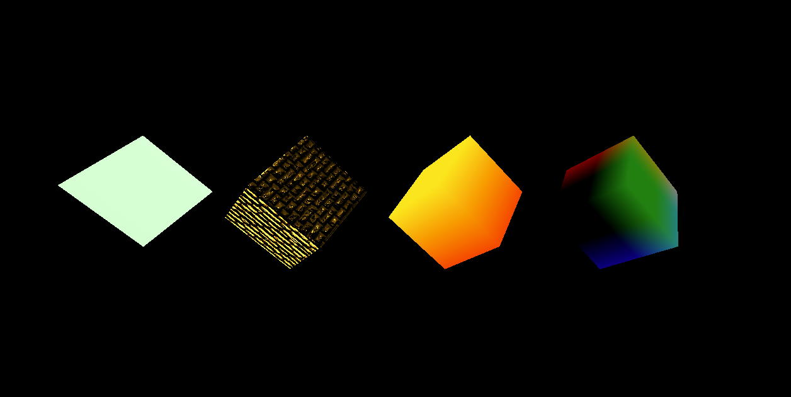
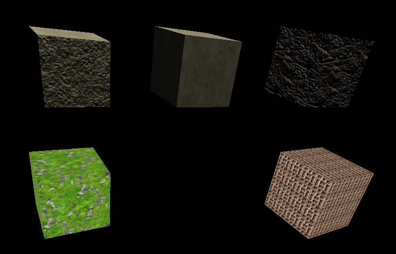

# cm163-Labs
 Labs for the game graphics class

# Lab2
[Video for part1](https://drive.google.com/file/d/1pWu6y_ckZrOspoGqalek8Jl1Z0oqBWdO/view?usp=sharing)

# Lab3
[Video of the cubes](https://drive.google.com/file/d/1XdfJv379qlZG7weaGTvk6wwvkdX4SZ6M/view?usp=sharing)

- The left cube is made using a meshPhong material provided by THREE.JS
- The second from the left is a combination of the previous material and a height map
- The next cube is an mixing between 2 colors (orange and yeallow)
- The last cube gives a color to each vertex of the cube based on their position and interpolates in between them

# Lab4
[Video of the cubes](https://drive.google.com/file/d/1LoJKRUBF0j84DZX0MrHIM1S408vYO-Ox/view?usp=sharing)

### 24
- a) x = (u * 7)
- b) y = (v * 7)
- black

### cubes

- The 1st cube is made with a texture and a normal for the texture using three.js library.
- The 2nd cube is made with a texture only using three.js library.
- The 3rd cube is made with a different texture and a normal for the texture using three.js library.
- The 4th cube is using our written vertex and fragment shader. Where the fragment shader uses a sampler to put a texture on the cube
- The 5th cube is using a modified version of the written fragShader. It implements a function which maps a UV point to a value in the range which depends on the number of tiles we want to have. For example, if we want to devide the cube in 4, that gives me a range of 0.25 to which I map a UV coordinate to fit in. Finally, I scale the vector passed to fragColor, to adjust the image into the tile size. Normally I would have preffered to use recursion, but glsl won't allow that. 

